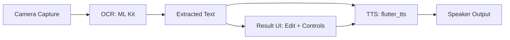

# Video Recording Script - IoT Image-to-Speech App

Use this as a spoken script and a checklist of what to show on screen. It is
written to match the current Flutter app in `iot_tts_app/`.

---

## 0) Title Slide (5-10s)

**Show:** Project title and team names.

**Say:**
“Hello, this is our IoT Image-to-Speech project. We built a Flutter mobile app
that captures an image, extracts the text with on-device OCR, and reads it out
loud using text-to-speech.”

---

## 1) Problem & Goal (15-20s)

**Show:** A quick example image containing text (paper, label, or sign).

**Say:**
“The goal is to help users quickly hear printed text without typing. We focus
on an offline-friendly workflow: capture, recognize, and speak.”

---

## 2) High-Level Architecture (20-30s)

**Show:** The architecture diagram (use the Mermaid diagram below in slides or
GitHub preview).

**Say:**
“The app has three main steps: camera capture, OCR, and TTS. The UI coordinates
these services and provides controls and settings.”

---

## 3) Project Structure (30-40s)

**Show:** `iot_tts_app/lib/` folder in the editor.

**Say:**
“We organized the app by responsibility. `services/` handles camera, OCR, and
TTS. `providers/` contains app state, and `screens/` defines the UI pages.”

**Mention these folders:**
- `lib/services/` -> `camera_service.dart`, `ocr_service.dart`, `tts_service.dart`
- `lib/providers/` -> `app_provider.dart`
- `lib/screens/` -> `home_screen.dart`, `result_screen.dart`, `settings_screen.dart`
- `lib/config/` -> `app_config.dart`

---

## 4) App Entry + State Management (30-45s)

**Show:** `lib/main.dart` and `lib/providers/app_provider.dart`.

**Say:**
“The app starts in `main.dart`. We wrap the app with a `ChangeNotifierProvider`
so the UI can react to OCR and TTS state changes. The `AppProvider` manages:
processing state, last recognized text, and TTS settings like language, speech
rate, and pitch.”

**Key points to mention:**
- `ChangeNotifierProvider` supplies a single app state.
- Provider tracks `isProcessing`, `isSpeaking`, and `isTtsReady`.
- TTS is initialized once and re-initialized when settings change.

---

## 5) Camera Capture Flow (30-45s)

**Show:** `lib/services/camera_service.dart` and `lib/screens/home_screen.dart`.

**Say:**
“On the home screen we request camera permission. If granted, we initialize the
camera and display the live preview. When the user taps ‘Capture’, we take a
photo and send the image to OCR.”

**What to point out:**
- Permission handling using `permission_handler`.
- `CameraController` from the `camera` package.
- A loading overlay during OCR to prevent duplicate actions.

---

## 6) OCR Logic (30-45s)

**Show:** `lib/services/ocr_service.dart`.

**Say:**
“OCR is handled by Google ML Kit. We pass the captured image path, process it,
and then sort the detected lines for a more natural reading order. The app also
handles right-to-left languages like Arabic.”

**Key details to mention:**
- Uses `google_mlkit_text_recognition`.
- Collects `TextLine` entries and sorts them for readability.
- Returns clean text for the result page.

---

## 7) Result Screen + TTS Controls (30-45s)

**Show:** `lib/screens/result_screen.dart`.

**Say:**
“After OCR, we show the captured image and the extracted text. The user can
edit the text, then use Play, Pause, or Stop to control speech output.”

**Callouts:**
- Editable `TextField` with OCR result.
- TTS buttons are disabled if TTS is not ready or if speech is already playing.

---

## 8) TTS Service (30-45s)

**Show:** `lib/services/tts_service.dart`.

**Say:**
“We use `flutter_tts` to access the device’s built-in text-to-speech engine.
We set the language, speech rate, and pitch, and listen for start/stop events
to keep the UI state accurate.”

**Details to mention:**
- Uses `setStartHandler`, `setCompletionHandler`, `setCancelHandler`.
- `awaitSpeakCompletion(true)` ensures state updates are reliable.

---

## 9) Settings Screen (20-30s)

**Show:** `lib/screens/settings_screen.dart` and `lib/config/app_config.dart`.

**Say:**
“The settings screen lets the user choose a language and tune speech rate and
pitch. We also include a ‘Test Voice’ button to preview the TTS settings.”

**Mention supported languages:**
- `en-US`, `ar-SA`, `fr-FR`

---

## 10) Live Demo Flow (45-60s)

**Show:** Run the app on a phone or emulator.

**Say:**
“Now we’ll demonstrate the complete flow. We’ll capture a page, run OCR, edit
the text, and then play it back with TTS. We’ll also show the settings changes
affecting the voice.”

**Demo steps:**
1. Open app → show camera preview.
2. Capture a page with clear printed text.
3. Show OCR result and optionally edit a word.
4. Tap Play, Pause, Stop.
5. Go to Settings → change language and speech rate.
6. Use Test Voice → return and play again.

---

## 11) Testing & Reliability (15-20s)

**Say:**
“We manually tested the main workflow: camera permissions, capture, OCR, and
speech. The app also handles busy states to prevent duplicate actions.”

---

## 12) Future Enhancements (15-20s)

**Say:**
“In the future, we can add scan history, multi-page capture, better layout
understanding, and more languages or offline voice packs.”

---

## 13) Closing (10s)

**Say:**
“That’s our IoT Image-to-Speech project. Thanks for watching!”

